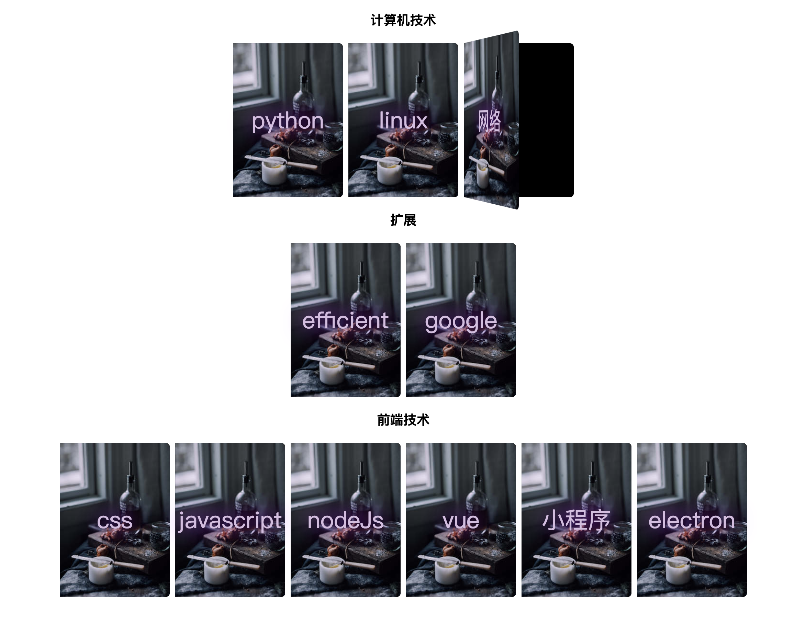

# README

> This is a project that uses [docsify](https://github.com/docsifyjs/docsify) to sum things up.

## book list

| class      | book                                                                    | more                                            |
| ---------- | ----------------------------------------------------------------------- | ----------------------------------------------- |
| 计算机技术 | [python](https://treecrow.github.io/docsify-books/python-book/#/)       | python 相关知识点整理                           |
| ~          | [linux](https://treecrow.github.io/docsify-books/linux-book/#/)         | linux 相关知识点整理                            |
| ~          | [network](https://treecrow.github.io/docsify-books/network-book/#/)     | network 相关知识点整理                          |
| 扩展       | [efficient](https://treecrow.github.io/docsify-books/efficient-book/#/) | 提高工作效率（包括 macbook pro 相关知识点整理） |
| ~          | [google](https://treecrow.github.io/docsify-books/google-book/#/)       | google 相关知识点整理                           |
| 前端技术   | [css](https://treecrow.github.io/docsify-books/css-book/#/)             | css 相关知识点整理                              |
| ~          | [js](https://treecrow.github.io/docsify-books/js-book/#/)               | js 相关知识点整理                               |
| ~          | [node](https://treecrow.github.io/docsify-books/node-book/#/)           | ndoe 相关知识点整理                             |
| ~          | [vue](https://treecrow.github.io/docsify-books/vue-book/#/)             | vue 相关知识点整理                              |
| ~          | [small](https://treecrow.github.io/docsify-books/small-book/#/)         | 小程序 相关知识点整理                           |
| ~          | [electron](https://treecrow.github.io/docsify-books/electron-book/#/)   | electron 相关知识点整理                         |