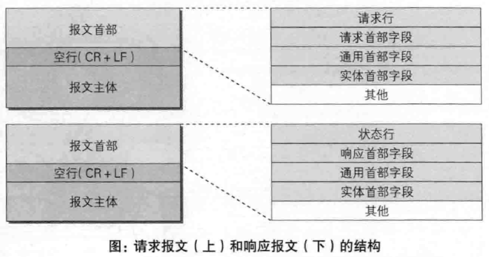

# HTTP 报文

## 报文的结构

## HTTP／1.1规范定义了如下47种首部字段

- 通用首部字段 --- 请求报文和响应报文两方都会使用的首部
- 请求首部字段 --- 只会在请求报文中会使用的首部
- 响应首部字段 --- 只会在响应报文中会使用的首部
- 实体首部字段 --- 针对请求报文和响应报文的实体部分使用的首部

分类     | 字段                  | more
------ | ------------------- | ---------------------------------
通用首部字段 | Cache-Control       | 控制缓存的工作机制
-      | Connection          | 表示是否需要持久连接（HTTP 1.1默认持久连接）
-      | Date                | 创建报文的日期时间
-      | Pragma              | 报文指令
-      | Trailer             | 报文末端的首部一览
-      | Transfer-Encoding   | 指定报文主体的传输编码方式
-      | Upgrade             | 升级为其他协议
-      | Via                 | 代理服务器的相关信息
-      | Warning             | 错误通知
请求首部字段 | Accept              | 用户代理可处理的媒体类型
-      | Accept-Charset      | 优先的字符集
-      | Accept-Encoding     | 优先的内容编码
-      | Accept-Language     | 优先的语言（自然语言）
-      | Authorization       | web认证信息
-      | Expect              | 期待服务器的特定行为
-      | From                | 用户的电子邮箱信息
-      | Host                | 请求资源所在的服务器
-      | If-Match            | 比较实体标记（ETag）
-      | If-Modified-Since   | 比较资源的更新时间
-      | If-None-Match       | 比较实体标记（与 If-Match 相反）
-      | If-Range            | 资源未更新时发送实体 Byte 的范围请求
-      | If-Unmodified-Since | 比较资源的更新时间（与 If-Modified-Since 相反）
-      | Max-Forwards        | 最大传输逐跳数
-      | Proxy-Authorization | 代理服务器要求客户端的认证信息
-      | Range               | 实体的字节范围请求
-      | Referer             | 对请求中URI的原始获取方
-      | TE                  | 传输编码的优先级
-      | User-Agent          | HTTP 客户端程序的信息
响应首部字段 | Accept-Ranges       | 是否接受字节范围请求
-      | Age                 | 推算资源创建的时间
-      | ETag                | 资源的匹配信息
-      | Location            | 令客户端重定向至指定URI
-      | Proxy-Authenticate  | 代理服务器对客户端的认证信息
-      | Retry-After         | 对再次发起请求的时机要求
-      | Server              | HTTP 服务器的安装信息
-      | Vary                | 代理服务器缓存的管理信息
-      | WWW-Authenticate    | 服务器对客户端的认证信息
实体首部字段 | Allow               | 资源可支持的HTTP 方法
-      | Content-Encoding    | 实体主体适用的编码方式
-      | Content-Language    | 实体主体的自然语言
-      | Content-Length      | 实体主体的大小（字节）
-      | Content-Location    | 替代对应资源的URI
-      | Content-MD5         | 实体主体的报文摘要
-      | Content-Range       | 实体主体的位置范围
-      | Content-Type        | 实体主体的媒体类型
-      | Expires             | 实体主体过期的日期时间
-      | Last-Modified       | 资源的最后修改时间

## 端到端首部与逐跳首部

> 端到端首部(end-to-end): 首部必须被转发，

> 逐跳首部(hop-by-hop):只对单次转发有效，会因通过缓存或代理而不再转发

### 逐跳首部字段列表（其余字段均为端到端首部字段）

字段                  | more
------------------- | ----
Connection          | -
Keep-Alive          | -
Proxy-Authenticate  | -
Proxy-Authorization | -
Trailer             | -
TE                  | -
Transfer-Encoding   | -
Upgrade             | -

## 其他首部字段

分类     | 字段                  | more
------ | ------------------- | ------------------------------------------
请求首部字段 | Cookie              | HTTP请求发送时，会把保存在该请求域名下的所有cookie值一起发送给web服务器
响应首部字段 | Set-Cookie          | 通知客户端保存 cookie
实体首部字段 | Content-Disposition | 激活文件下载对话框
未分类    | Keep-Alive          | 控制 TCP 断开时间
-      | X-Frame-Options     | -
-      | X-XSS-Protection    | -
-      | DNT                 | -
-      | P3P                 | -
