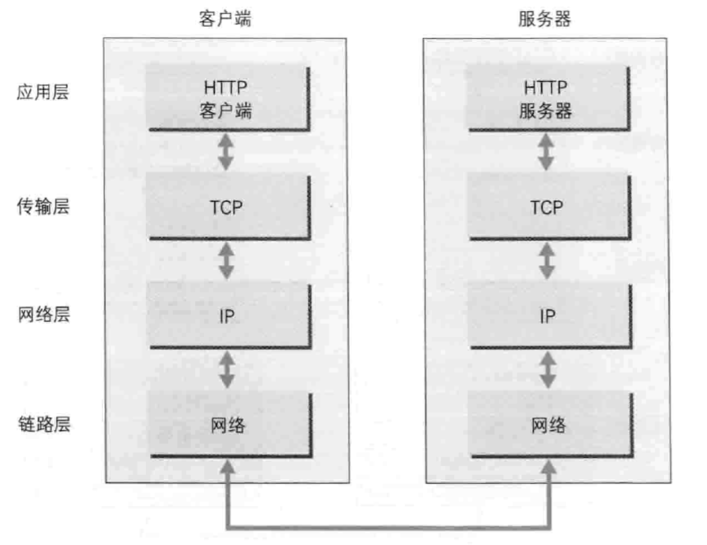
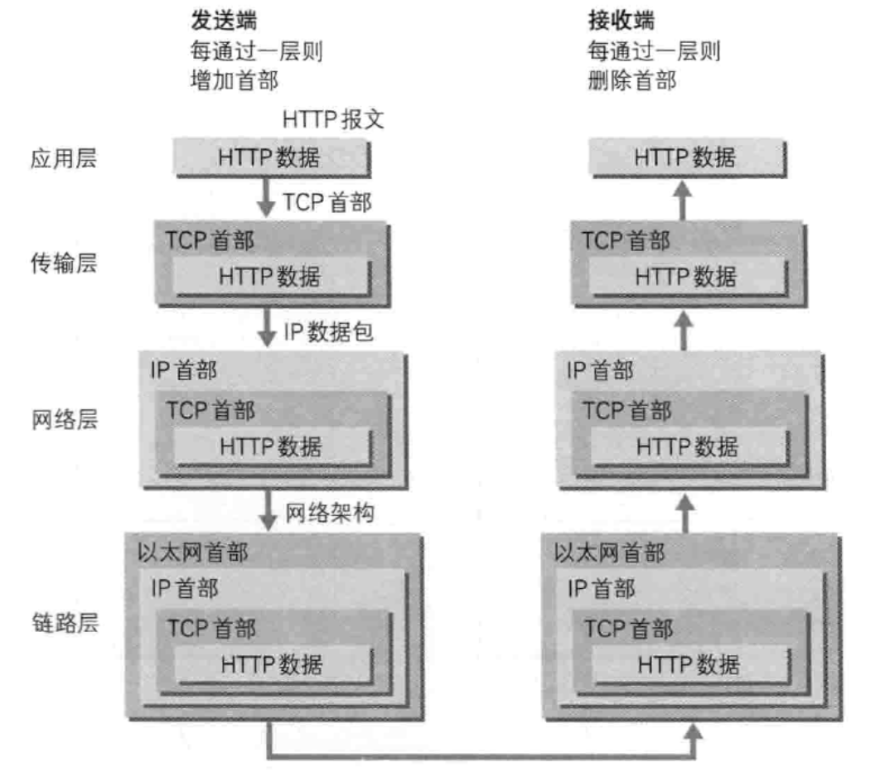
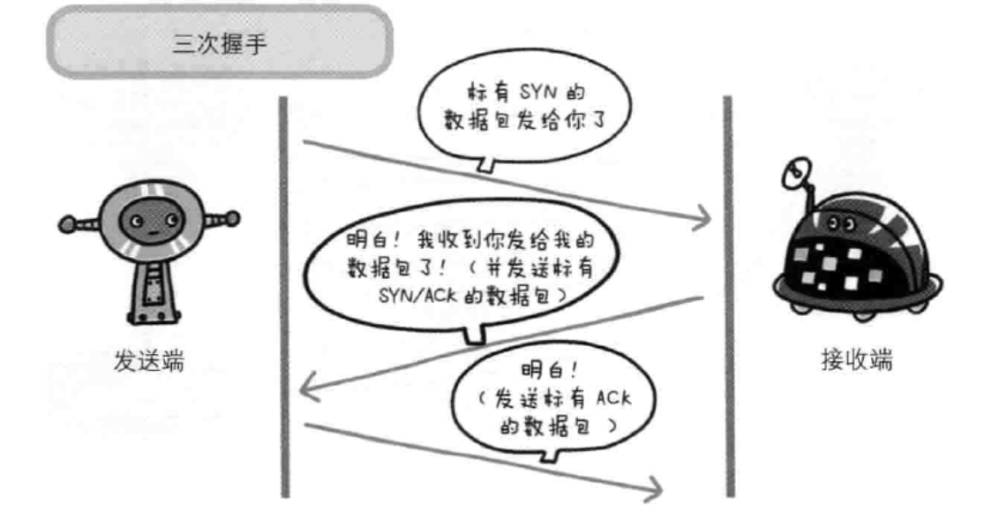
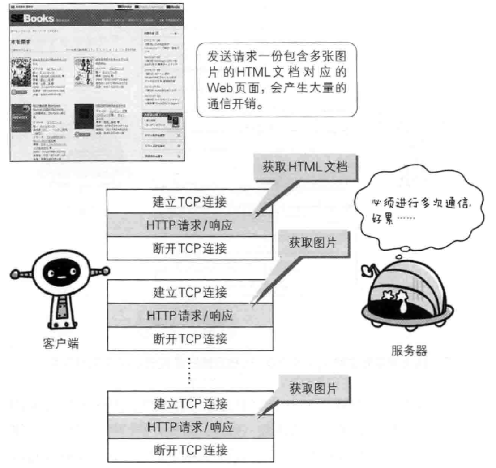
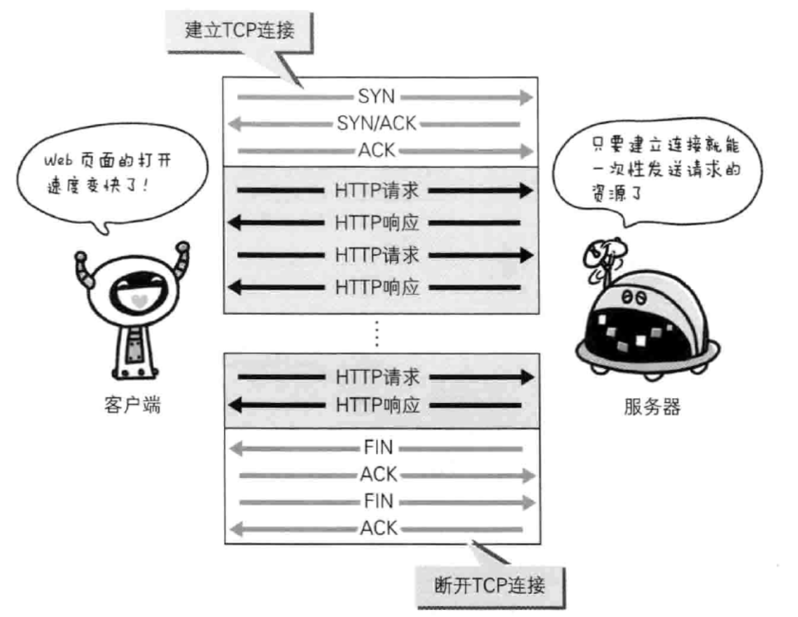
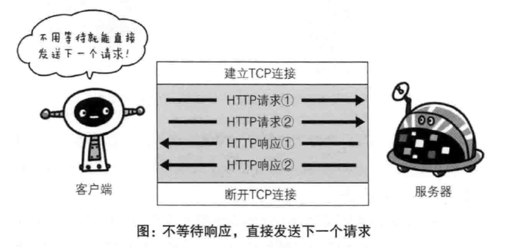
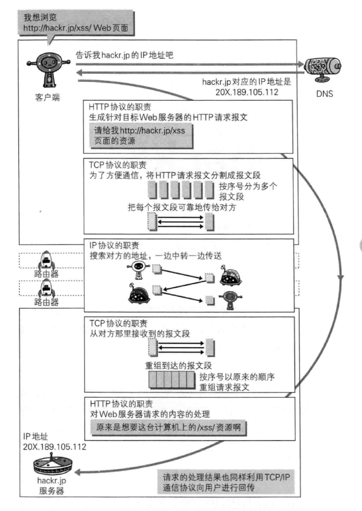

# TCP / IP

> TCP / IP 是互联网相关的各类协议族的总称

## TCP / IP的分层管理

层次                 | more
------------------ | ---------------------------------------------
应用层                | 决定了向用户提供应用服务时通信的活动
传输层                | 对上层应用层，提供处于网络连接中的两台计算机之间的数据传输
网络层（有名网络互连层）       | 用来处理在网络上流动的数据包。该层规定了通过怎样的路径到达对方计算机，并将数据包发送给对方
链路层（又名网络链路层，网络接口层） | 用来处理连接网络的硬件部分，包括控制操作系统、硬件的设备驱动、NIC及光纤等物理可见部分

## TCP / IP 包含的相关协议

层次  | 协议         | 全名                            | more
--- | ---------- | ----------------------------- | ----------------------------------
应用层 | FTP        | File Transfer Protocol        | 文件传输协议
-   | DNS        | Domain Name System            | 域名系统
-   | HTTP       | HyperText Transfer Protocol   | 超文本传输（转移）协议
传输层 | TCP        | Transmission Control Protocol | 传输控制协议
-   | UDP        | User Data Protocol            | 用户数据报协议
网络层 | IP         | Internet Protocol             | 网络协议
-   | ARP        | Address Resolution Protocol   | 地址解析协议（根据通信方的 IP 地址就可以反查出对应的MAC地址）
链路层 | -          | -                             | -
未分类 | IEEE 802.3 | -                             | -
-   | FDDI       | -                             | -
-   | ICMP       | -                             | -
-   | PPPoE      | -                             | -
-   | SNMP       | -                             | -

## TCP/IP通信传输流

## 信息包传输过程中等封装

## 与 HTTP 关系密切的协议：IP 、TCP 和 DNS

### 负责传输的 IP 协议

条件     | 全名                           | more
------ | ---------------------------- | -----------------
IP 地址  | -                            | 指明了节点被分配到的地址（可变换）
MAC 地址 | Media Access Control Address | 网卡所属的固定地址（基本不变）

### 确保可靠性的 TCP 协议

#### 字节流服务

> 为了方便传输，将大块数据分割成以报文段（segment）为单位的数据包进行管理

#### 可靠的传输服务（三次握手）

#### TCP 不持续连接的问题

#### TCP 的持久连接

#### TCP 管线化

### 负责域名解析的 DNS 服务

### HTTP 请求过程概览

