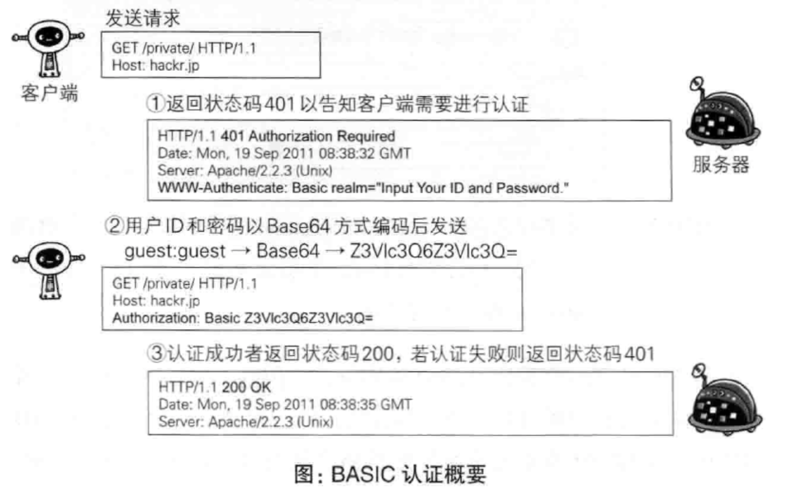
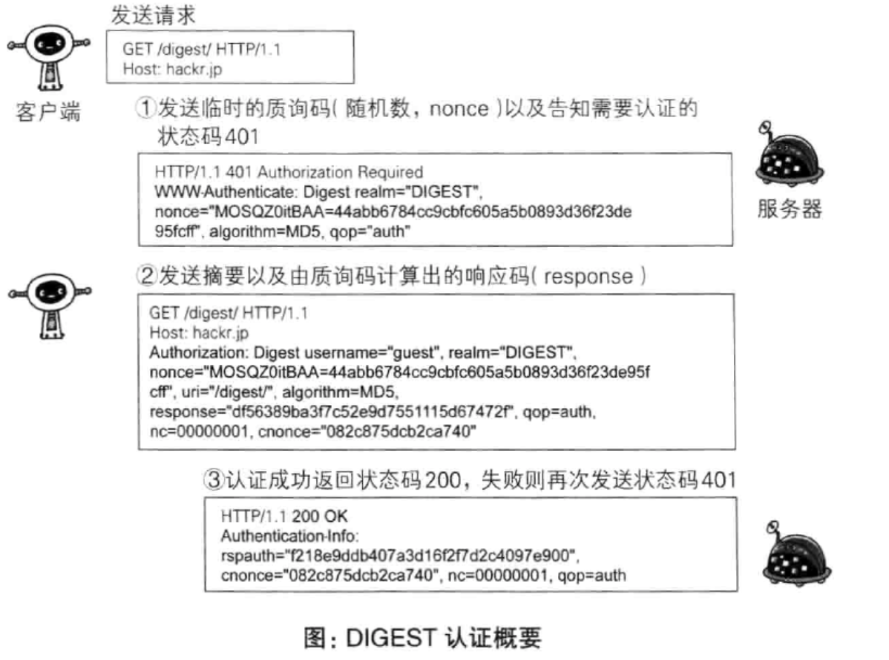

# 访问用户身份的认证

## HTTP/1.1使用的认证方式

认证方式        | more
----------- | -----------
BASIC 认证    | 基本认证
DIGEST 认证   | 摘要认证
SSL         | 客户端认证
FormBase 认证 | 基于表单认证（最常用）

## BASIC 认证

## DIGEST 认证

## SSL 客户端认证

> 略

## 基于表单认证

### cookie

- 作用示意图

- cookie 相关字段

字段       | more
-------- | --------------------------------------------------------------------------------
path     | 表示 cookie 影响到的路径，匹配该路径才发送这个 cookie
expires  | 告诉浏览器这个 cookie 什么时候过期（ UTC 格式时间）
maxAge   | 告诉浏览器这个 cookie 什么时候过期（多久后过期的相对时）
secure   | 当 secure 值为 true 时，cookie 在 HTTP 中是无效，在 HTTPS 中才有效
httpOnly | 浏览器不允许脚本操作 document.cookie 去更改 cookie。一般情况下都应该设置这个为 true，这样可以避免被 xss 攻击拿到 cookie
