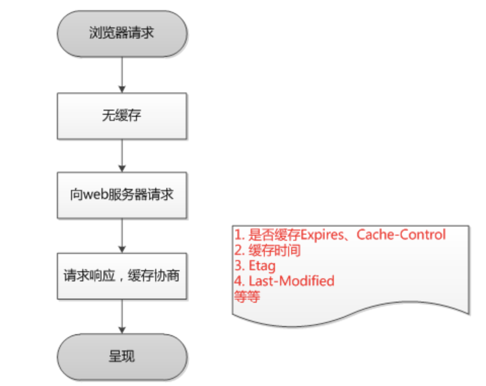
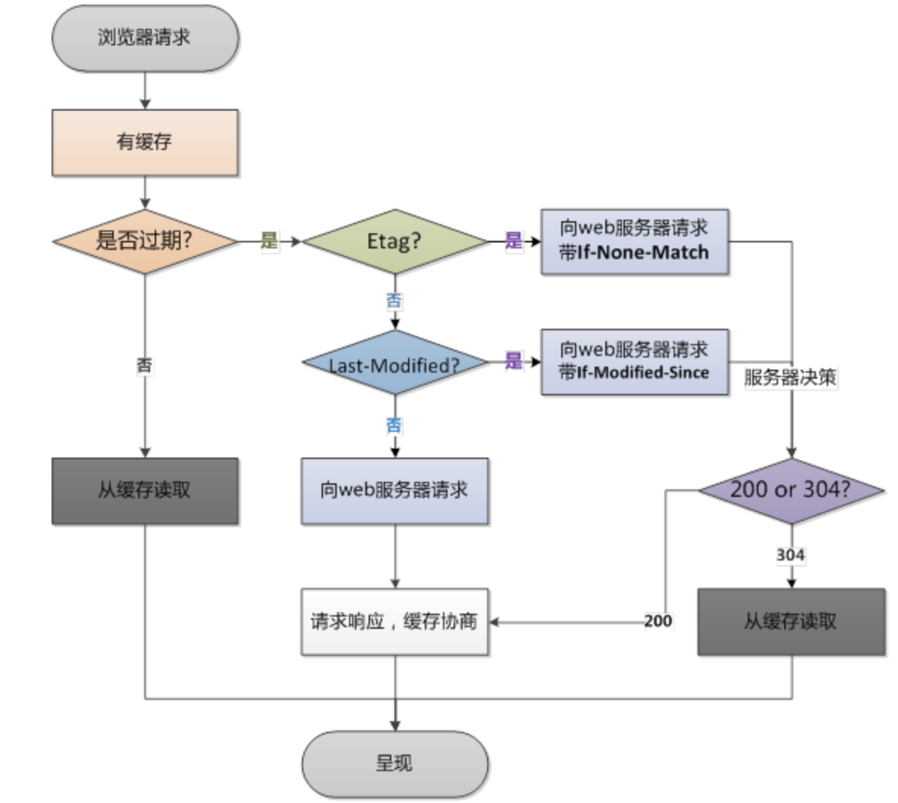

# 浏览器缓存详解

- [浏览器缓存详解:expires,cache-control,last-modified,etag详细说明](http://blog.csdn.net/eroswang/article/details/8302191)
- [Etag & If-None-Match 专题](https://www.cnblogs.com/softidea/p/5986339.html)
- [http协商缓存VS强缓存](https://www.cnblogs.com/wonyun/p/5524617.html)

## head

```html
<meta http-equiv="Cache-Control" content="max-age=0" />
<meta http-equiv="Expires" content="0" />
```

## 浏览器第一次请求时：



## 浏览器后续在进行请求时
