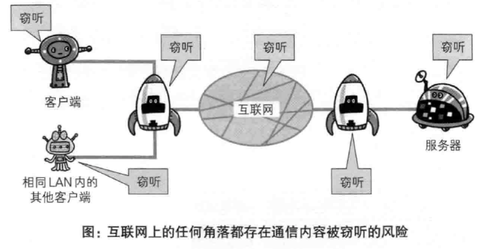
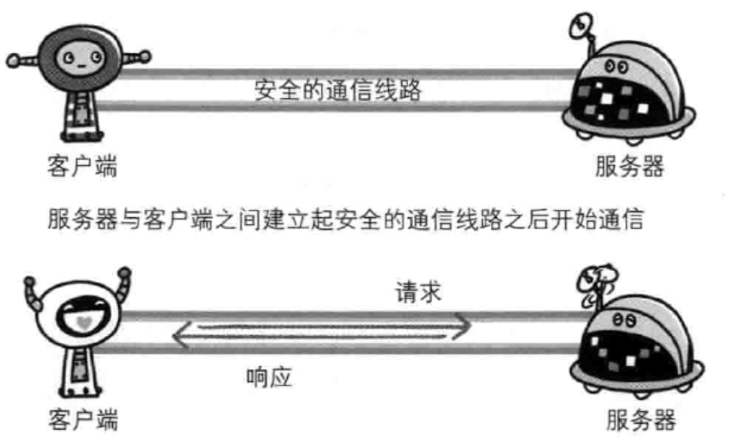
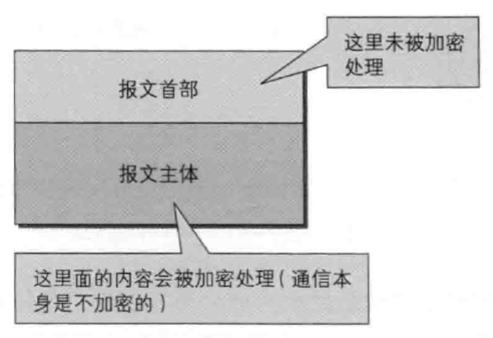
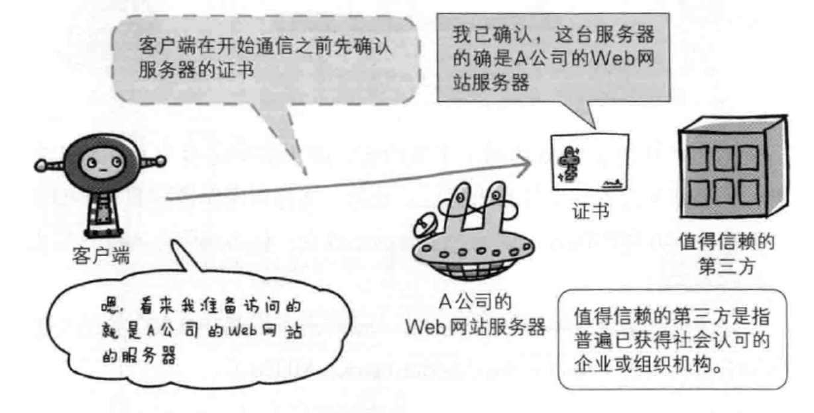
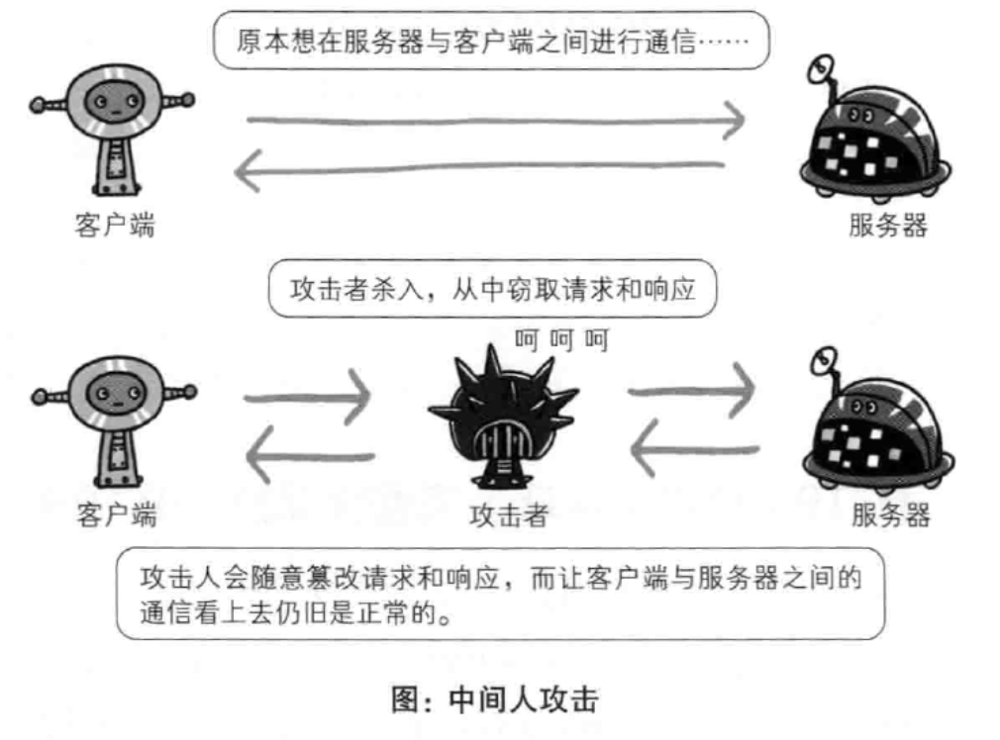
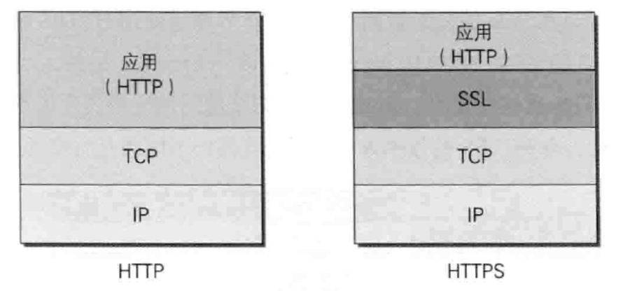
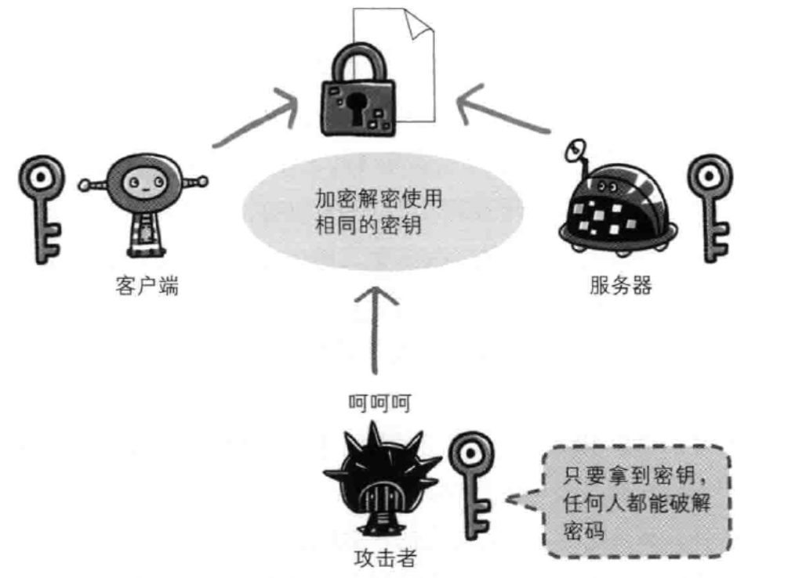
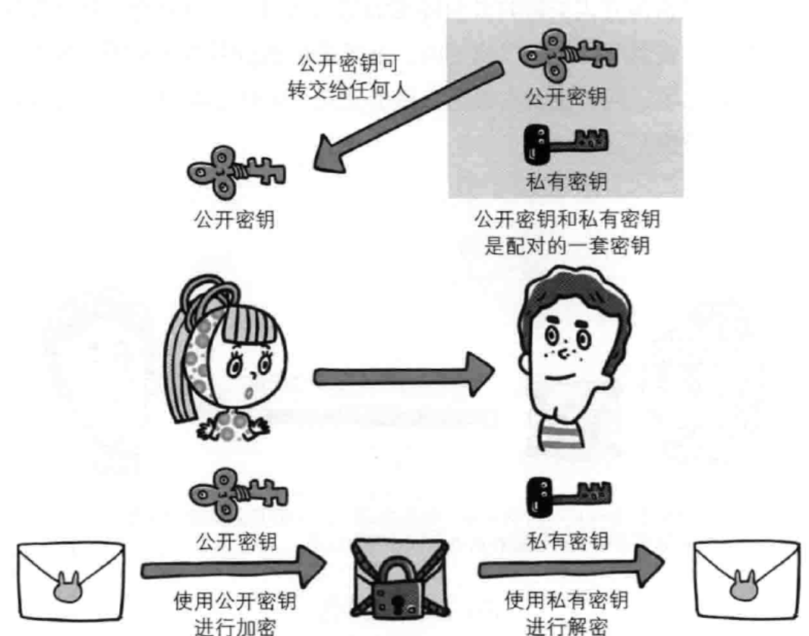
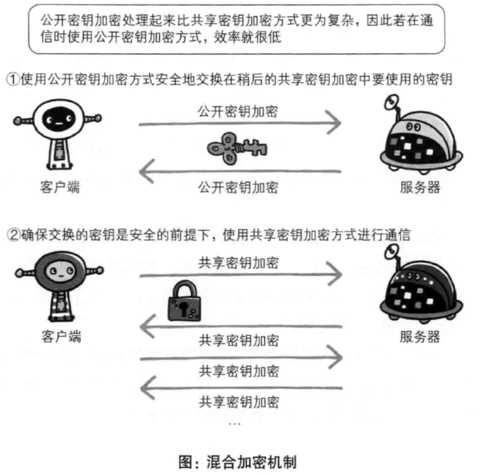
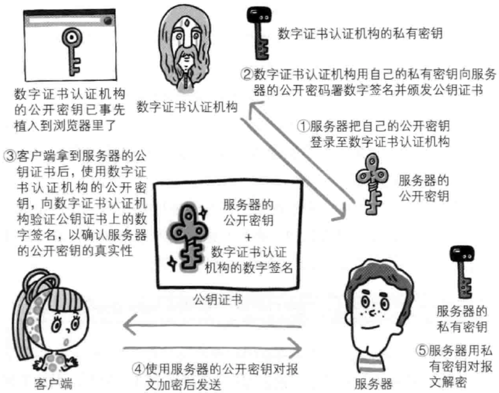

# HTTPS

## HTTP 的缺点

序号 | 缺点
-- | --------------------
1  | 通信使用明文（不加密），内容可能会被窃听
2  | 不验证通信方的身份，因此有可能遭遇伪装
3  | 无法证明报文的完整性，所以有可能已遭篡改

## 解决 HTTP 的缺点

### 通信使用明文被窃听

- 解决方案（加密技术）

| 技术       | more                                           |
| ---------- | ---------------------------------------------- |
| 通信的加密 | 与 SSL 或 TLS 组合使用的 HTTP 协议被成为 HTTPS |
| 内容的加密 | 将参与通信的内容本身加密                       |

### 不验证通信方的身份，可能遭遇伪装

#### 查明对手的证书

### 无法证明报文的完整性，可能已遭篡改

- 解决方案

> 下列方法无法百分百保证确认结果正确，HTTPS 能够解决这个问题

| 方案                 | more        |
| -------------------- | ----------- |
| 散列值校验           | MD5 / SHA-1 |
| 数字签名（确认文件） | PGP         |

## HTTPS

> HTTP + 加密 + 认证 + 完整性保护 = HTTPS，在采用了 SSL 后，HTTP 就拥有了 HTTPS 的加密、证书和完整性保护这些功能

### 秘钥加密技术

- 共享秘钥

- 公开秘钥

- HTTPS 采用混合加密机制

### HTTPS 证书（证明公开秘钥正确性的证书）

> 通过数字证书认证机构

### HTTPS 的问题

| 问题                            | more |
| ------------------------------- | ---- |
| 加密通信消耗更多的CPU和内存资源 | -    |
| 证书需要购买                    | -    |
