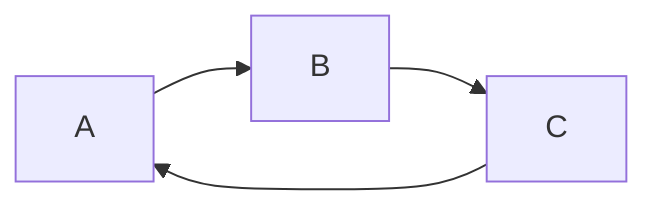
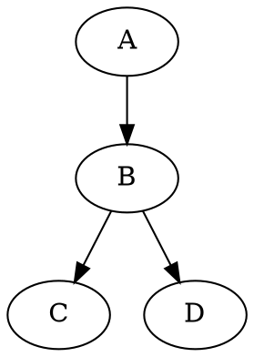

# chart

## Flow Charts (基于 [flowchart.js](http://flowchart.js.org/) 渲染)

> 从图表的文本表示中绘制简单的 SVG 流程图

```flow
st=>start: Start:>http://www.google.com[blank]
e=>end:>http://www.google.com
op1=>operation: My Operation
sub1=>subroutine: My Subroutine
cond=>condition: Yes
or No?:>http://www.google.com
io=>inputoutput: catch something...
para=>parallel: parallel tasks

st->op1->cond
cond(yes)->io->e
cond(no)->para
para(path1, bottom)->sub1(right)->op1
para(path2, top)->op1
```

## Sequence Diagrams (基于 [js-sequence-diagrams](https://bramp.github.io/js-sequence-diagrams/) 渲染)

```sequence
Andrew->China: Says Hello
Note right of China: China thinks\nabout it
China-->Andrew: How are you?
Andrew->>China: I am good thanks!
```

```sequence (theme="hand")
Andrew->China: Says Hello
Note right of China: China thinks\nabout it
China-->Andrew: How are you?
Andrew->>China: I am good thanks!
```

## Mermaid (基于 [mermaid](https://github.com/knsv/mermaid) 渲染)

> 渲染流程图和时序图



## WaveDrom (基于 [wavedrom](http://wavedrom.com/) 渲染)

> 数字时序图

```wavedrom
{ signal: [
  { name: "clk",         wave: "p.....|..." },
  { name: "Data",        wave: "x.345x|=.x", data: ["head", "body", "tail", "data"] },
  { name: "Request",     wave: "0.1..0|1.0" },
  {},
  { name: "Acknowledge", wave: "1.....|01." }
]}
```

## GraphViz (基于 [viz.js](https://github.com/mdaines/viz.js) 渲染)

> 渲染 dot 语言 图形




## Vega 和 Vega-lite (基于 [Vega](xxxxx) 或 [Vega-lite](xxxxx) 渲染)

> 渲染流程图和时序图

```vega
{
  "$schema": "https://vega.github.io/schema/vega/v5.json",
  "width": 500,
  "height": 200,
  "padding": 5,

  "signals": [
    {
      "name": "interpolate",
      "value": "linear",
      "bind": {
        "input": "select",
        "options": [
          "basis",
          "cardinal",
          "catmull-rom",
          "linear",
          "monotone",
          "natural",
          "step",
          "step-after",
          "step-before"
        ]
      }
    }
  ],

  "data": [
    {
      "name": "table",
      "values": [
        {"x": 0, "y": 28, "c":0}, {"x": 0, "y": 20, "c":1},
        {"x": 1, "y": 43, "c":0}, {"x": 1, "y": 35, "c":1},
        {"x": 2, "y": 81, "c":0}, {"x": 2, "y": 10, "c":1},
        {"x": 3, "y": 19, "c":0}, {"x": 3, "y": 15, "c":1},
        {"x": 4, "y": 52, "c":0}, {"x": 4, "y": 48, "c":1},
        {"x": 5, "y": 24, "c":0}, {"x": 5, "y": 28, "c":1},
        {"x": 6, "y": 87, "c":0}, {"x": 6, "y": 66, "c":1},
        {"x": 7, "y": 17, "c":0}, {"x": 7, "y": 27, "c":1},
        {"x": 8, "y": 68, "c":0}, {"x": 8, "y": 16, "c":1},
        {"x": 9, "y": 49, "c":0}, {"x": 9, "y": 25, "c":1}
      ]
    }
  ],

  "scales": [
    {
      "name": "x",
      "type": "point",
      "range": "width",
      "domain": {"data": "table", "field": "x"}
    },
    {
      "name": "y",
      "type": "linear",
      "range": "height",
      "nice": true,
      "zero": true,
      "domain": {"data": "table", "field": "y"}
    },
    {
      "name": "color",
      "type": "ordinal",
      "range": "category",
      "domain": {"data": "table", "field": "c"}
    }
  ],

  "axes": [
    {"orient": "bottom", "scale": "x"},
    {"orient": "left", "scale": "y"}
  ],

  "marks": [
    {
      "type": "group",
      "from": {
        "facet": {
          "name": "series",
          "data": "table",
          "groupby": "c"
        }
      },
      "marks": [
        {
          "type": "line",
          "from": {"data": "series"},
          "encode": {
            "enter": {
              "x": {"scale": "x", "field": "x"},
              "y": {"scale": "y", "field": "y"},
              "stroke": {"scale": "color", "field": "c"},
              "strokeWidth": {"value": 2}
            },
            "update": {
              "interpolate": {"signal": "interpolate"},
              "fillOpacity": {"value": 1}
            },
            "hover": {
              "fillOpacity": {"value": 0.5}
            }
          }
        }
      ]
    }
  ]
}
```

```vega-lite
{
  "$schema": "https://vega.github.io/schema/vega-lite/v3.json",
  "config": {"view": {"stroke": ""}},
  "width": 800,
  "height": 200,
  "data": {
    "values": [
      {"country": "Great Britain", "animal": "cattle", "col": 3},
      {"country": "Great Britain", "animal": "cattle", "col": 2},
      {"country": "Great Britain", "animal": "cattle", "col": 1},
      {"country": "Great Britain", "animal": "pigs", "col": 2},
      {"country": "Great Britain", "animal": "pigs", "col": 1},
      {"country": "Great Britain", "animal": "sheep", "col": 10},
      {"country": "Great Britain", "animal": "sheep", "col": 9},
      {"country": "Great Britain", "animal": "sheep", "col": 8},
      {"country": "Great Britain", "animal": "sheep", "col": 7},
      {"country": "Great Britain", "animal": "sheep", "col": 6},
      {"country": "Great Britain", "animal": "sheep", "col": 5},
      {"country": "Great Britain", "animal": "sheep", "col": 4},
      {"country": "Great Britain", "animal": "sheep", "col": 3},
      {"country": "Great Britain", "animal": "sheep", "col": 2},
      {"country": "Great Britain", "animal": "sheep", "col": 1},
      {"country": "United States", "animal": "cattle", "col": 9},
      {"country": "United States", "animal": "cattle", "col": 8},
      {"country": "United States", "animal": "cattle", "col": 7},
      {"country": "United States", "animal": "cattle", "col": 6},
      {"country": "United States", "animal": "cattle", "col": 5},
      {"country": "United States", "animal": "cattle", "col": 4},
      {"country": "United States", "animal": "cattle", "col": 3},
      {"country": "United States", "animal": "cattle", "col": 2},
      {"country": "United States", "animal": "cattle", "col": 1},
      {"country": "United States", "animal": "pigs", "col": 6},
      {"country": "United States", "animal": "pigs", "col": 5},
      {"country": "United States", "animal": "pigs", "col": 4},
      {"country": "United States", "animal": "pigs", "col": 3},
      {"country": "United States", "animal": "pigs", "col": 2},
      {"country": "United States", "animal": "pigs", "col": 1},
      {"country": "United States", "animal": "sheep", "col": 7},
      {"country": "United States", "animal": "sheep", "col": 6},
      {"country": "United States", "animal": "sheep", "col": 5},
      {"country": "United States", "animal": "sheep", "col": 4},
      {"country": "United States", "animal": "sheep", "col": 3},
      {"country": "United States", "animal": "sheep", "col": 2},
      {"country": "United States", "animal": "sheep", "col": 1}
    ]
  },
  "mark": {"type": "point", "filled": true},
  "encoding": {
    "x": {"field": "col", "type": "ordinal", "axis": null},
    "y": {"field": "animal", "type": "ordinal", "axis": null},
    "row": {"field": "country", "type": "nominal", "header": {"title": ""}},
    "shape": {
      "field": "animal",
      "type": "nominal",
      "scale": {
        "domain": ["person", "cattle", "pigs", "sheep"],
        "range": [
          "M1.7 -1.7h-0.8c0.3 -0.2 0.6 -0.5 0.6 -0.9c0 -0.6 -0.4 -1 -1 -1c-0.6 0 -1 0.4 -1 1c0 0.4 0.2 0.7 0.6 0.9h-0.8c-0.4 0 -0.7 0.3 -0.7 0.6v1.9c0 0.3 0.3 0.6 0.6 0.6h0.2c0 0 0 0.1 0 0.1v1.9c0 0.3 0.2 0.6 0.3 0.6h1.3c0.2 0 0.3 -0.3 0.3 -0.6v-1.8c0 0 0 -0.1 0 -0.1h0.2c0.3 0 0.6 -0.3 0.6 -0.6v-2c0.2 -0.3 -0.1 -0.6 -0.4 -0.6z",
          "M4 -2c0 0 0.9 -0.7 1.1 -0.8c0.1 -0.1 -0.1 0.5 -0.3 0.7c-0.2 0.2 1.1 1.1 1.1 1.2c0 0.2 -0.2 0.8 -0.4 0.7c-0.1 0 -0.8 -0.3 -1.3 -0.2c-0.5 0.1 -1.3 1.6 -1.5 2c-0.3 0.4 -0.6 0.4 -0.6 0.4c0 0.1 0.3 1.7 0.4 1.8c0.1 0.1 -0.4 0.1 -0.5 0c0 0 -0.6 -1.9 -0.6 -1.9c-0.1 0 -0.3 -0.1 -0.3 -0.1c0 0.1 -0.5 1.4 -0.4 1.6c0.1 0.2 0.1 0.3 0.1 0.3c0 0 -0.4 0 -0.4 0c0 0 -0.2 -0.1 -0.1 -0.3c0 -0.2 0.3 -1.7 0.3 -1.7c0 0 -2.8 -0.9 -2.9 -0.8c-0.2 0.1 -0.4 0.6 -0.4 1c0 0.4 0.5 1.9 0.5 1.9l-0.5 0l-0.6 -2l0 -0.6c0 0 -1 0.8 -1 1c0 0.2 -0.2 1.3 -0.2 1.3c0 0 0.3 0.3 0.2 0.3c0 0 -0.5 0 -0.5 0c0 0 -0.2 -0.2 -0.1 -0.4c0 -0.1 0.2 -1.6 0.2 -1.6c0 0 0.5 -0.4 0.5 -0.5c0 -0.1 0 -2.7 -0.2 -2.7c-0.1 0 -0.4 2 -0.4 2c0 0 0 0.2 -0.2 0.5c-0.1 0.4 -0.2 1.1 -0.2 1.1c0 0 -0.2 -0.1 -0.2 -0.2c0 -0.1 -0.1 -0.7 0 -0.7c0.1 -0.1 0.3 -0.8 0.4 -1.4c0 -0.6 0.2 -1.3 0.4 -1.5c0.1 -0.2 0.6 -0.4 0.6 -0.4z",
          "M1.2 -2c0 0 0.7 0 1.2 0.5c0.5 0.5 0.4 0.6 0.5 0.6c0.1 0 0.7 0 0.8 0.1c0.1 0 0.2 0.2 0.2 0.2c0 0 -0.6 0.2 -0.6 0.3c0 0.1 0.4 0.9 0.6 0.9c0.1 0 0.6 0 0.6 0.1c0 0.1 0 0.7 -0.1 0.7c-0.1 0 -1.2 0.4 -1.5 0.5c-0.3 0.1 -1.1 0.5 -1.1 0.7c-0.1 0.2 0.4 1.2 0.4 1.2l-0.4 0c0 0 -0.4 -0.8 -0.4 -0.9c0 -0.1 -0.1 -0.3 -0.1 -0.3l-0.2 0l-0.5 1.3l-0.4 0c0 0 -0.1 -0.4 0 -0.6c0.1 -0.1 0.3 -0.6 0.3 -0.7c0 0 -0.8 0 -1.5 -0.1c-0.7 -0.1 -1.2 -0.3 -1.2 -0.2c0 0.1 -0.4 0.6 -0.5 0.6c0 0 0.3 0.9 0.3 0.9l-0.4 0c0 0 -0.4 -0.5 -0.4 -0.6c0 -0.1 -0.2 -0.6 -0.2 -0.5c0 0 -0.4 0.4 -0.6 0.4c-0.2 0.1 -0.4 0.1 -0.4 0.1c0 0 -0.1 0.6 -0.1 0.6l-0.5 0l0 -1c0 0 0.5 -0.4 0.5 -0.5c0 -0.1 -0.7 -1.2 -0.6 -1.4c0.1 -0.1 0.1 -1.1 0.1 -1.1c0 0 -0.2 0.1 -0.2 0.1c0 0 0 0.9 0 1c0 0.1 -0.2 0.3 -0.3 0.3c-0.1 0 0 -0.5 0 -0.9c0 -0.4 0 -0.4 0.2 -0.6c0.2 -0.2 0.6 -0.3 0.8 -0.8c0.3 -0.5 1 -0.6 1 -0.6z",
          "M-4.1 -0.5c0.2 0 0.2 0.2 0.5 0.2c0.3 0 0.3 -0.2 0.5 -0.2c0.2 0 0.2 0.2 0.4 0.2c0.2 0 0.2 -0.2 0.5 -0.2c0.2 0 0.2 0.2 0.4 0.2c0.2 0 0.2 -0.2 0.4 -0.2c0.1 0 0.2 0.2 0.4 0.1c0.2 0 0.2 -0.2 0.4 -0.3c0.1 0 0.1 -0.1 0.4 0c0.3 0 0.3 -0.4 0.6 -0.4c0.3 0 0.6 -0.3 0.7 -0.2c0.1 0.1 1.4 1 1.3 1.4c-0.1 0.4 -0.3 0.3 -0.4 0.3c-0.1 0 -0.5 -0.4 -0.7 -0.2c-0.3 0.2 -0.1 0.4 -0.2 0.6c-0.1 0.1 -0.2 0.2 -0.3 0.4c0 0.2 0.1 0.3 0 0.5c-0.1 0.2 -0.3 0.2 -0.3 0.5c0 0.3 -0.2 0.3 -0.3 0.6c-0.1 0.2 0 0.3 -0.1 0.5c-0.1 0.2 -0.1 0.2 -0.2 0.3c-0.1 0.1 0.3 1.1 0.3 1.1l-0.3 0c0 0 -0.3 -0.9 -0.3 -1c0 -0.1 -0.1 -0.2 -0.3 -0.2c-0.2 0 -0.3 0.1 -0.4 0.4c0 0.3 -0.2 0.8 -0.2 0.8l-0.3 0l0.3 -1c0 0 0.1 -0.6 -0.2 -0.5c-0.3 0.1 -0.2 -0.1 -0.4 -0.1c-0.2 -0.1 -0.3 0.1 -0.4 0c-0.2 -0.1 -0.3 0.1 -0.5 0c-0.2 -0.1 -0.1 0 -0.3 0.3c-0.2 0.3 -0.4 0.3 -0.4 0.3l0.2 1.1l-0.3 0l-0.2 -1.1c0 0 -0.4 -0.6 -0.5 -0.4c-0.1 0.3 -0.1 0.4 -0.3 0.4c-0.1 -0.1 -0.2 1.1 -0.2 1.1l-0.3 0l0.2 -1.1c0 0 -0.3 -0.1 -0.3 -0.5c0 -0.3 0.1 -0.5 0.1 -0.7c0.1 -0.2 -0.1 -1 -0.2 -1.1c-0.1 -0.2 -0.2 -0.8 -0.2 -0.8c0 0 -0.1 -0.5 0.4 -0.8z"
        ]
      },
      "legend": null
    },
    "color": {
      "field": "animal",
      "type": "nominal",
      "legend": null,
      "scale": {
        "domain": ["person", "cattle", "pigs", "sheep"],
        "range": [
          "rgb(162,160,152)",
          "rgb(194,81,64)",
          "rgb(93,93,93)",
          "rgb(91,131,149)"
        ]
      }
    },
    "opacity": {"value": 1},
    "size": {"value": 200}
  }
}
```

## matplotlib

```python {cmd=true matplotlib=true}
import matplotlib.pyplot as plt
plt.plot([1,2,3, 4])
plt.show() # show figure
```

## plotly

@import "https://cdn.plot.ly/plotly-lastest.min.js"

```javascript {cmd element="<div id='tester'></div>"}
const tester = document.getElementById("tester");
Plotly.plot(tester, [
  {
    x: [1, 2, 3, 4],
    y: [1, 2, 3, 4]
  },
  {
    margin: { t: 0 }
  }
]);
```

## gnuplot

> 需要运行

```gnuplot {cmd=true output="html"}
set terminal svg
set title "Simple Plots" font ",20"
set key left box
set samples 50
set style data points

plot [-10:10] sin(x),atan(x),cos(atan(x))
```
