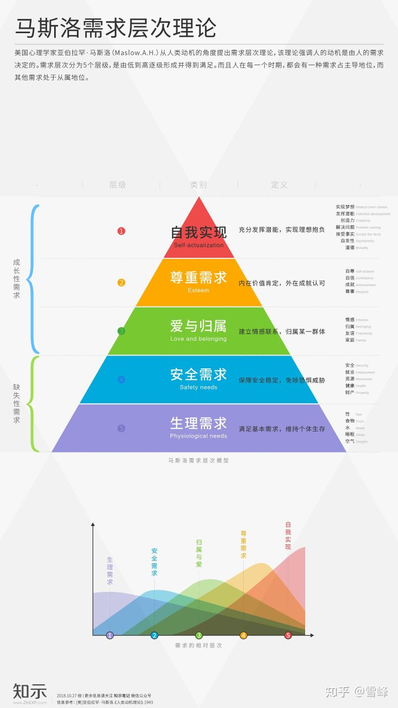

# 人生体验

- 滑坡理论
- 刻奇/媚俗

## 马斯洛需求

- [马斯洛需求层次理论模型](https://zhuanlan.zhihu.com/p/41176561)

## 社会交换理论

- [社会交换理论](https://baike.baidu.com/item/%E7%A4%BE%E4%BC%9A%E4%BA%A4%E6%8D%A2%E7%90%86%E8%AE%BA)

> 这个理论对社会交往中的报酬和代价进行分析。提出那些能够给我们 提供最多报酬的人是对我们吸引力最大的人。而且我们总是尽量使自已的社会交往给自已提供最大报酬。为了得到报酬，我们也要付出报酬。因为人类社会的原则是互相帮助，别人给了你好处你要回报，社会交往过程因此可以说是一个交换过程。

> 人是利己的  

- 对整个世界失望了，该怎么做？
  
> 任何美好的事物都经不起解构，或者说应该接受你眼中解构出来的东西本身就是美好；

## 自我欺骗

> 不想承认自己的不足，选择逃避

> 假装自己的某些需求已经得到了满足

- [詹青云 结辩](https://www.douban.com/note/695411196/)

| 行为                                                           | 结果                   |
| -------------------------------------------------------------- | ---------------------- |
| 面对自我不要有尊严，勇敢的承认，解决问题的关键是承认问题的存在 | 完成自我的成长         |
| 继续自我欺骗，不承认自身有不足的地方                          | 毫无变化，继续延续错误 |

- 鸵鸟钻入沙子
- 不管我人生发挥得怎样，社会如何对待我，不用在乎！我妥协、我看开、我豁达，就可以幸福（妥协的幸福观）

## 刻奇/媚俗

> 为了迎合外界环境的情感氛围，而违心的表现出自己并没有的情绪；

> 被外界的情感氛围裹挟；

- [刻奇（Kitsch）是什么？如何克服刻奇？](https://www.zhihu.com/question/27039705)

> 人类天生就有两种倾向。一种是变得和别人一样，一种是变得和别人不一样
> 
> 当众人都哭时，应该允许有的人不哭。当哭成为一种表演时，更应该允许有的人不哭

- 如何面对刻奇

## 要成为怎样的人

- 目的

> 人生体验好一些

- 如何做

> 尽最大可能的满足自己的各种需求

- 当下与未来的体验都重要

> 人生只有一次，所以应该把握住每一时刻。当然，为了长远的体验的考虑，有时候也需要规划长远，对当下的体验做妥协；

- 自我认同与社会道德观

| 认同度 | 是否符合社会道德观 | 行为后果                                             | 思考     |
| ------ | ------------------ | ---------------------------------------------------- | -------- |
| 认同   | 符合               | 皆大欢喜                                             | 选择做   |
| 认同   | 不符合             | 不被接受 && 有可能被看作另类、变态、疯狂 && 自我认同 | 选择做   |
| 不认同 | 符合               | 被接受 && 没有自我认同 && 自我欺骗                   | 选择不做 |
| 不认同 | 不符合             | 不被接受 && 没有自我认同 && 成熟道德煎熬             | 选择不做 |

> 逻辑线：自我认同是最大的道德观，自我认同大过社会道德；

- 人性经不起考验->他是我最好的兄弟，得加钱