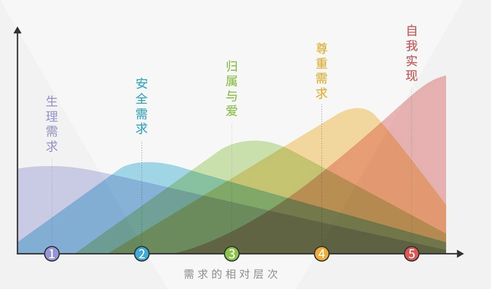

---
presentation:
  # Factor of the display size that should remain empty around the content
  margin: 0
  # Display the page number of the current slide
  slideNumber: true
  # Vertical centering of slides
  center: false
  # Loop the presentation
  loop: true
  # 自动播放
  # autoSlide: 500
  # Transition speed
  transitionSpeed: 'slow'

  # BackgroundImage
  parallaxBackgroundImage: "./LuMOOaZGIU4.jpg"
  parallaxBackgroundSize: "3000px 1000px"

---

<!-- slide -->
<div style="color:purple;">马斯洛需求</div>

<font size=3>[马斯洛需求层次理论模型](https://zhuanlan.zhihu.com/p/41176561)</font>



<!-- slide -->
<div style="color:purple;">社会交换理论</div>

> <p style="text-align:left; font-size:24px;">&nbsp;&nbsp;&nbsp;&nbsp;这个理论对社会交往中的报酬和代价进行分析。提出那些能够给我们 提供最多报酬的人是对我们吸引力最大的人。而且我们总是尽量使自已的社会交往给自已提供最大报酬。为了得到报酬，我们也要付出报酬。因为人类社会的原则是互相帮助，别人给了你好处你要回报，社会交往过程因此可以说是一个交换过程。</p>

```js
1. 人是利己的 
2. 细思极恐，对世界很失望 
3. 利己与自私
```

<!-- slide -->
<div style="color:purple;">自我欺骗</div>

```js
不想承认自己的不足，选择逃避, 假装自己的某些需求已经得到了满足
```

<table border="1" style="font-size:24px;">
  <tr>
    <th>行为</th>
    <th>结果</th>
  </tr>
  <tr>
    <td>面对自我不要有尊严，勇敢的承认，解决问题的关键是承认问题的存在</td>
    <td>完成自我的成长</td>
  </tr>
  <tr>
    <td>继续自我欺骗，不承认自身的不足</td>
    <td>毫无变化，继续延续错误</td>
  </tr>
</table>

```js
- 鸵鸟钻入沙子
- 不管我人生发挥得怎样，社会如何对待我，不用在乎！我看开、我豁达，就可以幸福（妥协的幸福观）
```

<font size=3>[詹青云 结辩](https://www.douban.com/note/695411196/)</font>

<!-- slide -->
<div style="color:purple;">刻奇</div>

> <p style="text-align:left; font-size:24px;">&nbsp;&nbsp;&nbsp;&nbsp;为了迎合外界环境的情感氛围，而违心的表现出自己并没有的情绪。(表现为被外界的情感氛围裹挟)</p>

```js
- 人类天生就有两种倾向。一种是变得和别人一样，一种是变得和别人不一样
- 当众人都哭时，应该允许有的人不哭。当哭成为一种表演时，更应该允许有的人不哭
```

<font size=3>[刻奇（Kitsch）是什么？如何克服刻奇？](https://www.zhihu.com/question/27039705)</font>

<table border="1" style="font-size:24px;">
  <tr>
    <th>了解刻奇的意义</th>
    <th>不需要极端</th>
  </tr>
  <tr>
    <td>保持自己人格的独立性，是对自我人格的尊重（自己的情绪没有那么廉价）</td>
    <td>只要是正常人，刻奇就难以避免，应该允许适度的刻奇的存在</td>
  </tr>
</table>

<!-- slide -->
<div style="color:purple;">自我认同</div>

<table border="1" style="font-size:24px;">
  <tr>
    <th width=100>认同度</th>
    <th>是否符合社会道德观</th>
    <th>行为后果</th>
  </tr>
  <tr>
    <td>认同</td>
    <td>符合</td>
    <td>➡️皆大欢喜</td>
  </tr>
  <tr>
    <td>认同</td>
    <td>不符合</td>
    <td>➡️不被接受 ➡️承受社会道德谴责，有可能被看作另类、变态、疯狂 ➡️自我认同，内心有力量对抗整个世界</td>
  </tr>
  <tr>
    <td>不认同</td>
    <td>符合</td>
    <td>➡️被接受 ➡️内心煎熬 ➡️自我欺骗 </td>
  </tr>
  <tr>
    <td>不认同</td>
    <td>不符合</td>
    <td>➡️不被接受 ➡️承受社会道德谴责 ➡️内心煎熬</td>
  </tr>
</table>

```js
- 自我认同是最大的道德观，自我认同大过社会道德；
- 如果一件事不符合社会的道德观，自己内心也认同社会对于这方面的共识，但是没有相关的制度建立，反而让遵守这种社会道德的人蒙受损失，那么，你可以违背这种社会道德；
```

<!-- slide -->
<div style="color:purple;">人生体验</div>

<table border="1" style="font-size:24px;">
  <tr>
    <th width=150>思考</th>
    <th>结论</th>
  </tr>
  <tr>
    <td>目的</td>
    <td>自己的人生体验更好一些</td>
  </tr>
  <tr>
    <td>行为</td>
    <td>尽最大可能的满足自己的各种需求</td>
  </tr>
  <tr>
    <td>当下与未来</td>
    <td>人生只有一次，所以应该把握住每一时刻。当然，为了长远的体验的考虑，有时候也需要规划长远，对当下的体验做妥协</td>
  </tr>
  <tr>
    <td>诱惑</td>
    <td>会不会为了利益放弃自我认同？放弃自我认同而获取不道德的利益，从而获得更好的人生体验，理论上是存在这种可能的</td>
  </tr>
</table>

<font size=3>[人性经不起考验](https://www.bilibili.com/video/av6637626/)</font>


<!-- slide -->
<div style="color:purple; margin-top:300px; font-size:48px;">END......</div>