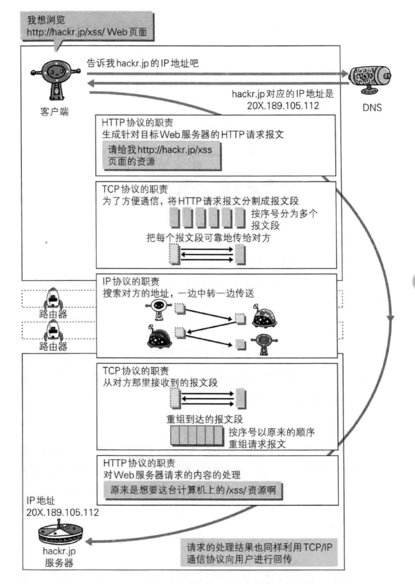
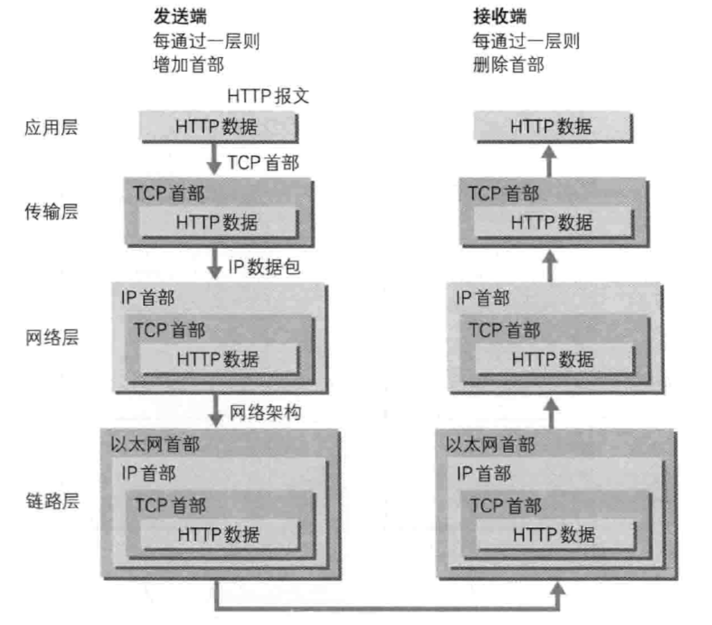
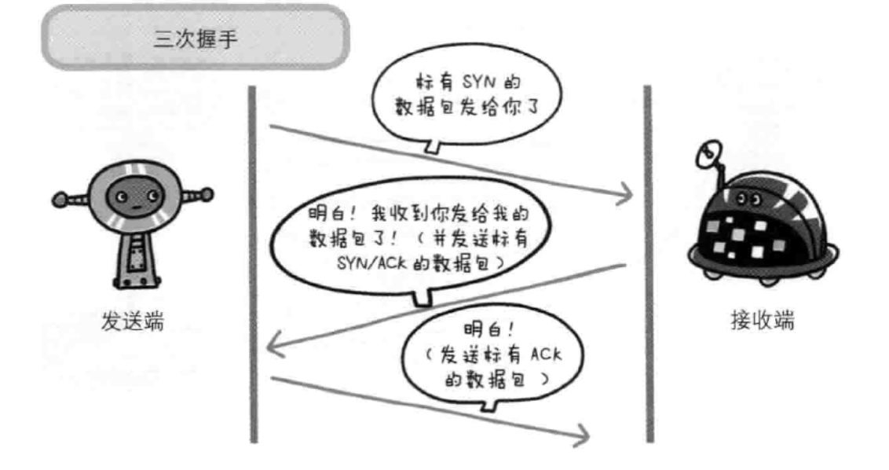
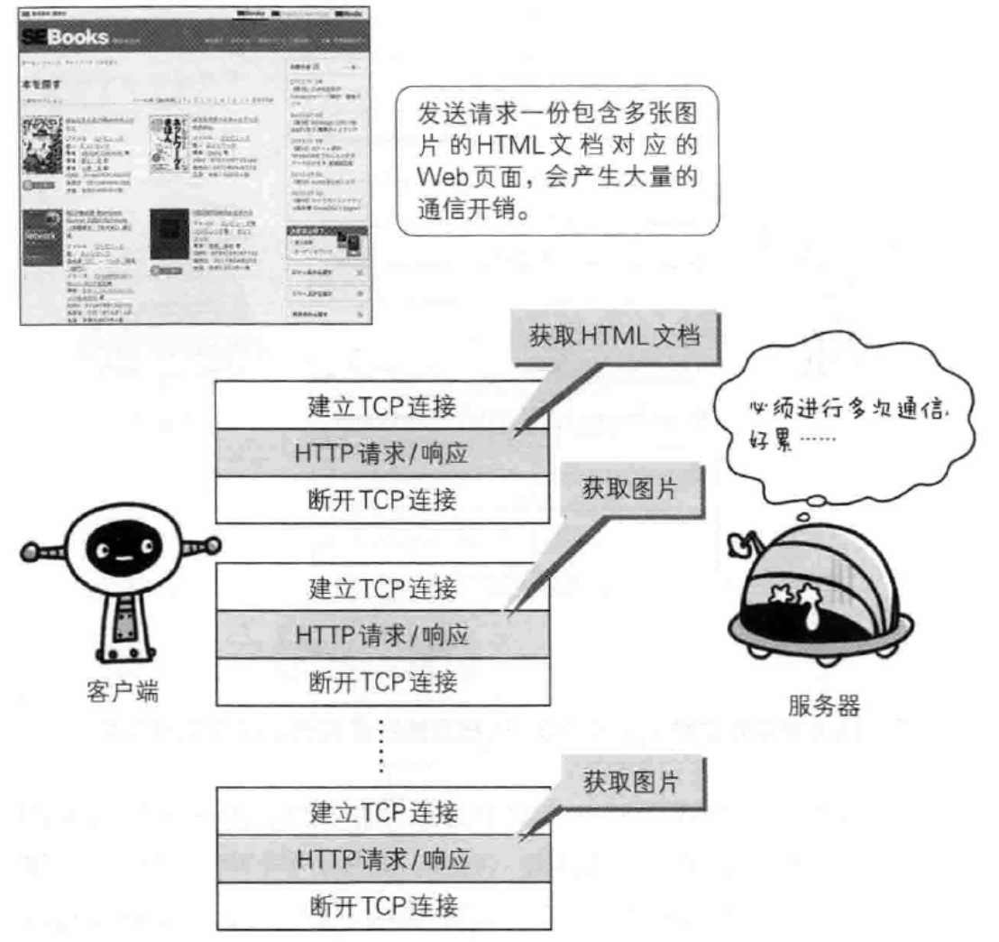

# HTTP 请求过程完整解读

## HTTP 请求过程概览

## TCP/IP 与 HTTP 的联系（概括）

### TCP/IP 通信传输流

### 信息包传输过程中等封装

## 与 HTTP 关系密切的协议：IP 、TCP 和 DNS（详解）

### 负责域名解析的 DNS 服务

#### DNS 查询(解析)过程

1. 本地的 hosts 文件
2. 本地 DNS 解析器缓存
3. 找 TCP/IP 参数中设置的首选 DNS 服务器(本地 DNS 服务器)
4. 根据本地 DNS 服务器的设置（是否设置转发器）进行查询
5. 本地 DNS 就把请求发至 "根 DNS 服务器"
6. "根 DNS 服务器"收到请求后会判断这个域名(.com)是谁来授权管理，并会返回一个负责该顶级域名服务器的一个 IP

### 负责传输的 IP 协议

| 条件     | 全名                         | more                               |
| -------- | ---------------------------- | ---------------------------------- |
| IP 地址  | -                            | 指明了节点被分配到的地址（可变换） |
| MAC 地址 | Media Access Control Address | 网卡所属的固定地址（基本不变）     |

### 确保可靠性的 TCP 协议

#### 字节流服务

> 为了方便传输，将大块数据分割成以报文段（segment）为单位的数据包进行管理

#### 可靠的传输服务（三次握手）

#### TCP 不持续连接的问题

#### TCP 的持久连接

#### TCP 管线化

