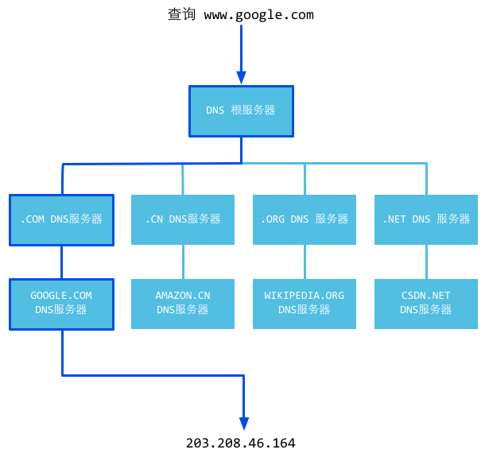

# HTTP总结

## 教程
- [《图解HTTP》]()
- [《HTTP权威指南》](https://book.douban.com/subject/10746113/)
- [图解Http协议](https://zhuanlan.zhihu.com/p/25518072)
- [网络基础知识之 HTTP 协议](https://zhuanlan.zhihu.com/p/24913080)
- [爬虫入门及HTTP协议的讲解](https://zhuanlan.zhihu.com/p/25035661)

## HTTP协议
#### 概念
> HTTP是一种让Web服务器与浏览器(客户端)通过Internet发送与接收数据的协议,它建立在TCP协议之上，一般采用TCP的80端口。它是一个请求、响应协议--客户端发出一个请求，服务器响应这个请求

#### 方法
方法名|含义
---|---
GET|获取、读取数据(查)
POST|提交数据(改)
PUT|更新(增)
DELETE|删除(删)
HEAD|类似GET，请求
TRACE|-
OPTIONS|-

#### 状态
- 1xx---请求已经接受，继续处理
  - 200：客户端请求成功
- 2xx---请求已经成功接受并处理
- 3xx---请求需要进一步的操作
- 4xx---客户端错误，请求语法错误/无法实现
  - 400：客户端请求有语法错误
  - 401：请求未经过授权
  - 403：服务端收到请求但拒绝提供服务
  - 404：请求资源不存在
- 5xx---服务器端错误
  - 500：服务端未知错误
  - 503：当前不能处理客户端的请求，可能过段时间会回复正常
  
#### HTTP请求包（浏览器信息）
内容|含义
---|---
GET/domains/example/ HTTP/1.1|请求行: 请求方法 请求URI HTTP协议/协议版本
Host：www.qixing318.com.|服务端的主机名
User-Agent：Mozilla/5.0 (Windows NT 6.1) AppleWebKit/537.4 (KHTML, like Gecko) Chrome/22.0.1229.94 Safari/537.4|客户端浏览器信息
Accept：text/html,application/xhtml+xml,application/xml;q=0.9,*/*;q=0.8|客户端能接收的mine类型
Accept-Encoding：gzip,deflate,sdcn|是否支持流压缩
Accept-Charset：UTF-8,*;q=0.5|客户端字符编码集
"\r\n\r\n"	|空行,用于分割请求头和消息体
"\r\n\r\n"|空行,消息体,请求资源参数,例如POST传递的参数
#### HTTP响应包（服务器信息）
内容|含义
---|---
HTTP/1.1 200 OK|状态行
Server: nginx/1.0.8 |服务器使用的WEB软件名及版本
Date:Date: Tue, 30 Oct 2012 04:14:25 GMT|发送时间
Content-Type: text/html|服务器发送信息的类型
Transfer-Encoding: chunked|表示发送HTTP包是分段发的
Connection: keep-alive|保持连接状态
Content-Length: 90|消息主体内容长度
\r\n|空行，用来分割消息头和主体
\<!DOCTYPE html PUBLIC "-//W3C//DTD XHTML 1.0 Transitional//EN"...|消息体部分
#### GET和POST的区别
序号|区别内容
---|---
1	|我们可以看到GET请求消息体为空，POST请求带有消息体。
2	|GET提交的数据会放在URL之后，以?分割URL和传输数据，参数之间以&相连，如EditPosts.aspx?name=test1&id=123456。POST方法是把提交的数据放在HTTP包的body中。
3	|GET提交的数据大小有限制（因为浏览器对URL的长度有限制），而POST方法提交的数据没有限制。
4	|GET方式提交数据，会带来安全问题，比如一个登录页面，通过GET方式提交数据时，用户名和密码将出现在URL上，如果页面可以被缓存或者其他人可以访问这台机器，就可以从历史记录获得该用户的账号和密码。

## 网络过程


1. 浏览器请求DNS服务器，通过DNS查询获取域名所对应的IP地址
2. 浏览器通过映射的IP地址找到IP对应的服务器，并通过TCP/IP协议建立到服务器的TCP连接---三次握手
3. 浏览器向服务器发送HTTP协议Request包
4. 服务器向客户机发送HTTP协议Response包，如果请求的资源包含有动态语言的内容，那么服务器会调用动态语言的解释引擎负责处理“动态内容”，并将处理得到的数据返回给客户端
5. 浏览器收到来自服务器的响应后就开始渲染这个Response包里的主体（body）部分
6. 收到全部的内容后断开与该服务器之间的连接,根据内容渲染页面(如果设置了Keep-Alive,浏览器与服务器之间的连接不会马上断开,断开的事件可以通过服务器端设置)

## URL(Uniform Resource Locator)---统一资源定位符
```
scheme://host[:port#]/path/.../[?query-string][#anchor]
```
url各个部分|含义
---|---
scheme|指定低层使用的协议(例如：http, https, ftp)
host|HTTP服务器的IP地址或者域名
port|HTTP服务器的默认端口是80，这种情况下端口号可以省略。如果使用了别的端口，必须指明，例如 http://www.qixing318.com:80/
path|访问资源的路径
query-string|发送给http服务器的数据
anchor|锚

## DNS(Domain Name System)---域名系统

#### DNS查询(解析)过程
1. 本地的hosts文件
2. 本地DNS解析器缓存
3. 找TCP/IP参数中设置的首选DNS服务器(本地DNS服务器)
4. 根据本地DNS服务器的设置（是否设置转发器）进行查询
5. 本地DNS就把请求发至 “根DNS服务器”
6. “根DNS服务器”收到请求后会判断这个域名(.com)是谁来授权管理，并会返回一个负责该顶级域名服务器的一个IP

